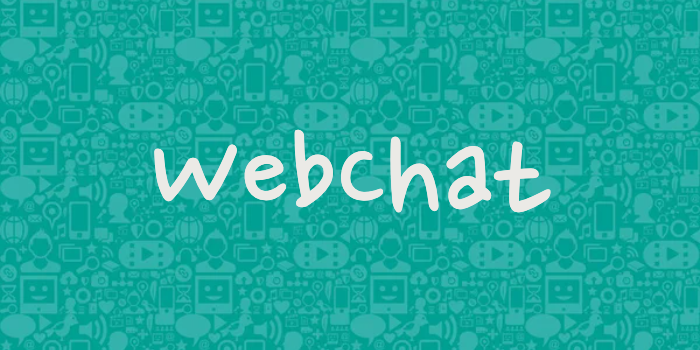
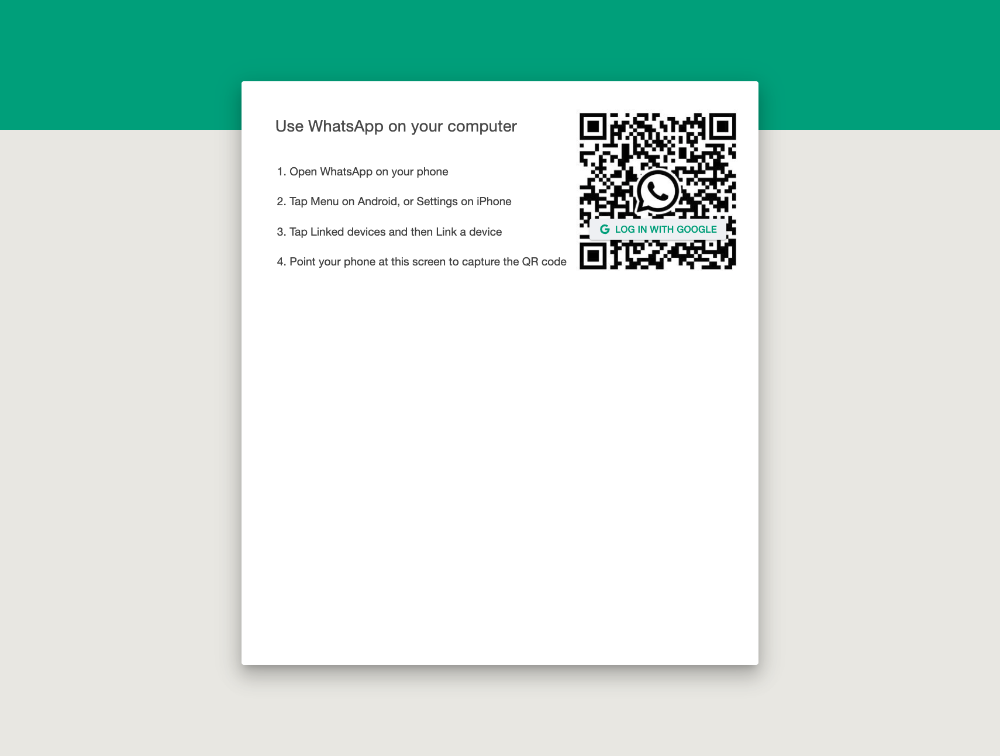
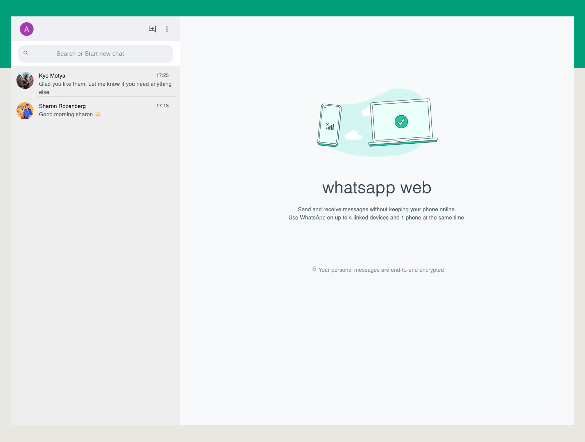
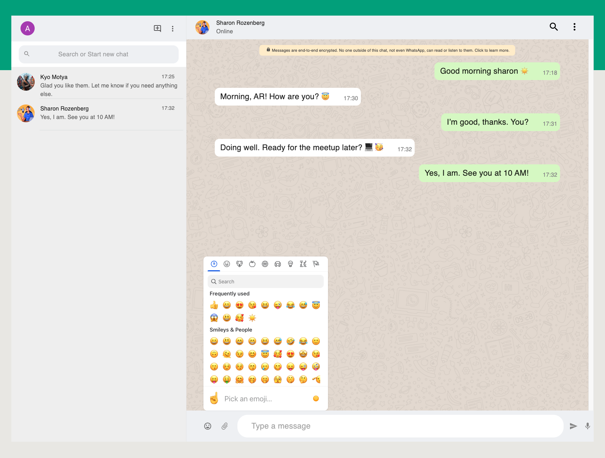
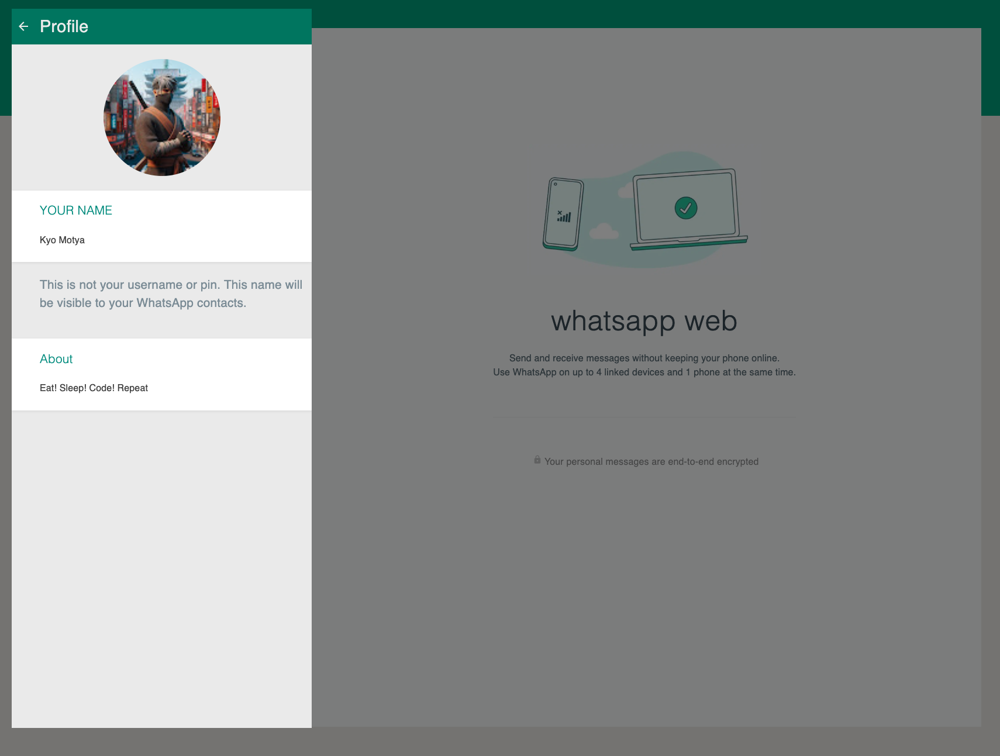
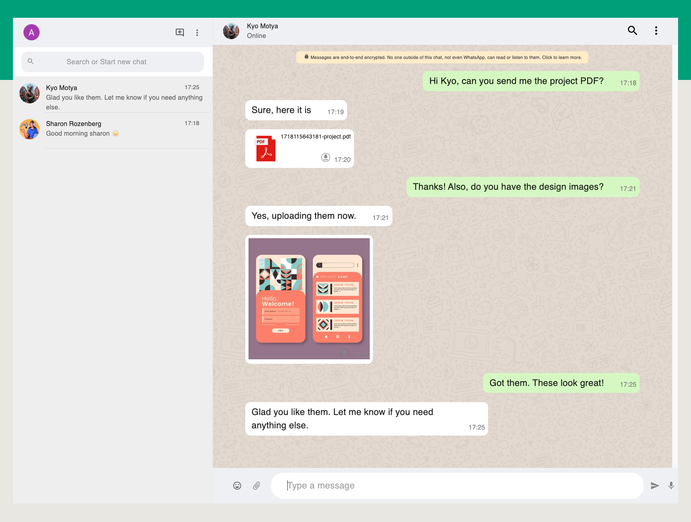

<h1 style="color:#2aa884" align="center" id="title">WebChat</h1>

<p align="center">
  
</p>
  <h1 style="color:#2aa884" align="center">Welcome to WebChat!</h1>
<p align="center" id="description">Inspired by WhatsApp Web, this project is built using modern web development technologies.<br> The primary objective is to replicate the core functionalities of WhatsApp Web.
<br>Build with a dynamic front-end powered by React, a reliable back-end built on Node.js and Express,<br> and secure media storage using AWS S3, WebChat showcases the best of modern web development.<br> Dive in and enjoy a seamless, feature-rich messaging experience!


</p>

---

<h2 style="color:#2aa884" align="center">Project Screenshots</h2>

<p align="center">
  
  
  
  
  
</p>

---

<h2 style="color:#2aa884">🧐 Features</h2>

Here are some of the project's best features:

* **User Authentication:** Secure login and logout functionalities.
* **Real-time Messaging:** Instant messaging using Socket.IO.
* **Media Sharing:** Upload and Download images and PDFs seamlessly.
* **User Status:** Displays online/offline status of users.
* **Responsive Design:** Fully responsive for all device sizes.
* **Enhanced Emoji Support:**  Send and receive emojis easily.
* **Search Conversations:** Quickly find messages with a search function.
* **Profile View:** View your own profile.

---
<h2 style="color:#2aa884">Live Action</h2>

* **Online Website:** <a href="https://web-chat-app-omor.onrender.com">WebChat</a>


<h2 style="color:#2aa884">🛠️ Installation Steps</h2>

1. **Clone the repository:**

    ```sh
    git clone https://github.com/ALICIALVO/Mern-web-chat-project.git
    cd whatsapp-web-project
    ```

2. **Install dependencies for both client and server:**

    ```sh
    cd client
    npm install
    cd server
    npm install
    ```

3. **Set up environment variables:**

    Create a `.env` file based on `.env.example`.

---

<h2 style="color:#2aa884">💻 Built With</h2>

Technologies used in the project:

<h3>Client:</h3>

* Vite
* ReactJs
* Material-UI
* Styled-components
* Axios
* Socket.io-client
  
<h3>Server:</h3>

* NodeJs
* ExpressJs
* MongoDB
* Mongoose
* Socket.IO
* JWT
* AWS S3
* PassportJs
* Multer

---

<h2 style="color:#2aa884">🛡️ License</h2>

This project is licensed under the MIT License.


